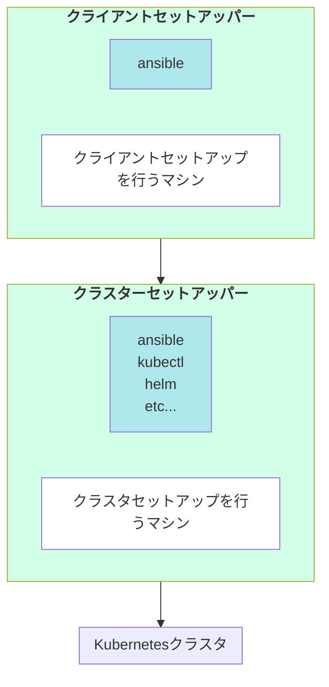

# Set Up 設計

## 概要図

```mermaid
%%{init: {'flowchart': {'htmlLabels': true, 'wrap': true}, 'securityLevel': 'loose'}}%%
graph TB
    classDef Machine fill:#22FF88,fill-opacity:0.2,font-weight:bold
    classDef Tools fill:#2288FF,fill-opacity:0.2
    classDef Description fill:#FFFFFF

    subgraph ClientSetUpper ["クライアントセットアッパー"]
        SetUpperTools["ansible"]
        SetUpperDescription["クライアントセットアップを行うマシン"]
    end

    subgraph ClusterSetUpper ["クラスターセットアッパー"]
        ClientTools["ansible</br>kubectl</br>helm</br>etc..."]
        ClientDescription["クラスタセットアップを行うマシン"]
    end
    
    subgraph K8sCluster ["Kubernetesクラスタ"]

    end
    
    ClientSetUpper --> ClusterSetUpper --> K8sCluster

    class SetUpperTools Tools
    class ClientTools Tools
    class ClusterSetUpper Machine
    class ClientSetUpper Machine
    class SetUpperDescription Description
    class ClientDescription Description
```

