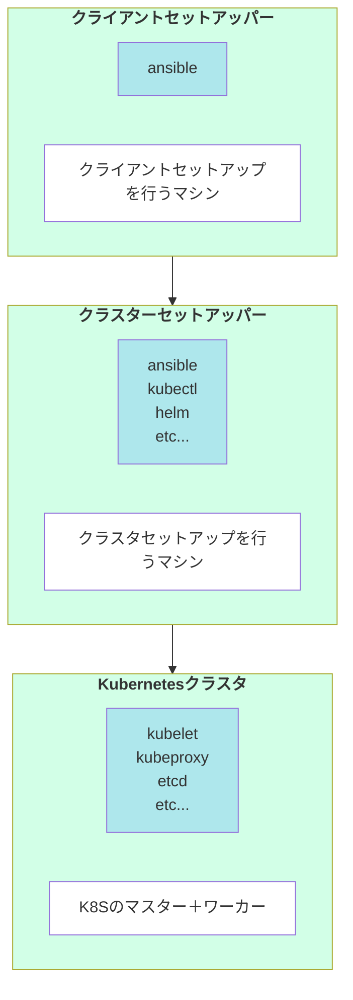

# Set Up 設計

## 概要図

```mermaid
%%{init: {'theme': 'default'}}%%
graph TB
    classDef Machine fill:#22FF88,fill-opacity:0.2,font-weight:bold
    classDef Tools fill:#2288FF,fill-opacity:0.2
    classDef Description fill:#FFFFFF

    subgraph ClientSetUpper ["クライアントセットアッパー"]
        SetUpperTools["ansible"]
        SetUpperDescription["クライアントセットアップを行うマシン"]
    end

    subgraph ClusterSetUpper ["クラスターセットアッパー"]
        ClientTools["ansible</br>kubectl</br>helm</br>etc..."]
        ClientDescription["クラスタセットアップを行うマシン"]
    end
    
    subgraph K8sCluster ["Kubernetesクラスタ"]
        K8sTools["kubelet</br>kubeproxy</br>etcd</br>etc..."]
        K8sDescription["K8Sのマスター＋ワーカー"]
    end
    
    ClientSetUpper --> ClusterSetUpper --> K8sCluster

    class ClusterSetUpper Machine
    class ClientSetUpper Machine
    class K8sCluster Machine
    class SetUpperTools Tools
    class ClientTools Tools
    class K8sTools Tools
    class SetUpperDescription Description
    class ClientDescription Description
    class K8sDescription Description
```

## 役割
### クライアントセットアッパー
kubenetesクラスターを構築するマシンに対してセットアップを行うマシン
Ansibleのみインストールしクラスタのセットアップに必要なツールはインストールしない
