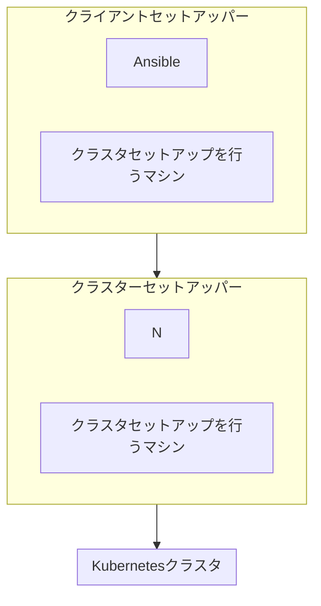

# Set Up 設計

## 概要図

```mermaid
graph TB
    subgraph ClientSetUpper ["クライアントセットアッパー"]
        SetUpperTools["Ansible"]
        SetUpperDescription["クラスタセットアップを行うマシン"]
    end

    subgraph ClusterSetUpper ["クラスターセットアッパー"]
        ClientTools["N"]
        ClientDescription["クラスタセットアップを行うマシン"]
    end
    
    subgraph K8sCluster ["Kubernetesクラスタ"]

    end
    
    ClientSetUpper --> ClusterSetUpper --> K8sCluster
```

