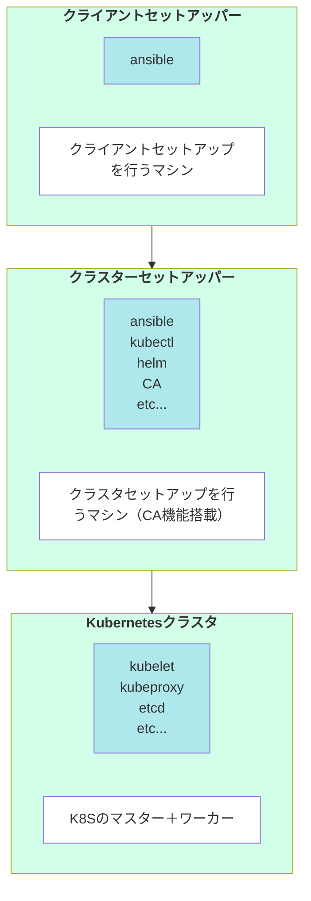

# Set Up 設計

## リスト
| Layer              | Role                                                       | Name      |
| ------------------ | ---------------------------------------------------------- | --------- |
| 管理用             | クラスタ構築用のコードを開発・実行するマシン               | admin     |
| クラスタ構築環境   | Ansible、Terraform、kubeadm などでクラスタを構築する仕組み | bootstrap |
| Kubernetesクラスタ | 実際に稼働するクラスタ                                     | cluster   |

## 概要図

## 役割
### admin
kubernetesクラスターを構築するマシンに対してセットアップを行うマシン
Ansibleのみインストールしクラスタのセットアップに必要なツールはインストールしない

### bootstrap
kubernetesクラスターを構築するマシン
クラスタには参加せずセットアップのみを行う
また、クラスタのCA（認証局）としても機能する

インストールするツール一覧

- マシン構築
  - Ansible
- クラスタ構築
  - kubectl
  - Helm
  - Cilium CLI

